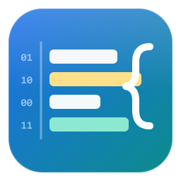
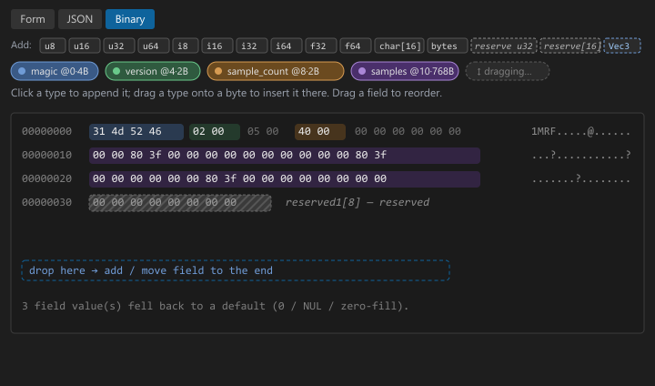

# Binary File Designer

A VS Code extension for **designing** binary structures and **generating artifacts**
from the design — a sample binary, a C header, and a layout document.

<br clear="left" />


It is the design-time counterpart to a binary *viewer*: instead of opening a
`.bin` and decoding it against a format, you lay out a structure in a form editor
and the extension produces files from it.


---

## What you get

| Piece | Description |
| ----- | ----------- |
| **Form / JSON / Binary editor** | A tree editor for a `*.design.json` file: add fields, arrays, enums, bitfields and reusable structs; a type combo box; inline enum/bitfield tables; drag a row's grip to reorder; a live **layout preview** (offset · name · C type · size, plus total size and packer padding). A **JSON tab** edits the whole design as text; auto-selected when the form can't losslessly represent the design. |
| **Binary tab** | A live hex dump of the sample binary this design would generate — every field's bytes colour-coded, hover to cross-highlight the layout row, ASCII gutter. An **Add** palette (`u8 … f64`, `char[16]`, `bytes[4]`, `enum`, `array`, `struct`, and every reusable struct): click to append a field, or drag it onto a byte to insert it there. **Drag an existing field** (its coloured chip, or its highlighted bytes) onto another to reorder; drop on the end zone to move it last. Every edit writes straight back to the `.design.json`. |
| **Generate Sample Binary** | Walks the design and writes `<name>.bin` using each field's `value` (or a sensible default), honoring `packing` and per-field endianness. Reports the byte count and any defaulted fields, and offers a **round-trip check**. |
| **Generate C Header** | Emits `<name>.h` with `#pragma pack`, typedef'd structs/enums/bitfields in dependency order, and a `_Static_assert` on `sizeof` so layout drift fails the compile. Also writes `<name>_layout.md`. |
| **Generate Layout Doc** | Writes just `<name>_layout.md` — the offset table. |
| **Designs view** | An Activity Bar view that lists every `*.design.json` in the workspace (with size / error count); a file watcher keeps it current. |

Nothing in a design is ever executed. Sample values use a fixed, tiny expression
vocabulary (`const`, `ramp`, `repeat`, `random`) evaluated by hand-written code.

### Binary tab



The **Binary** tab renders the sample binary this design would generate. Each
top-level field's bytes are tinted with a stable per-name colour; hovering a
field chip, a byte run, or a layout-preview row cross-highlights the other two.

- **Add a field** — click a type in the **Add** row (`u8 … f64`, `char[16]`,
  `bytes[4]`, `enum`, `array`, `struct`, `reserve u32`, `reserve[16]`, or any
  reusable struct) to append it, or drag it onto a byte to splice it in
  before/after that field. New fields get an auto name and a zero/empty default;
  tweak them in the Form or JSON tab.
- **Reserve space for the future** — the `reserve` palette entries (or the `rsv`
  toggle on any Form row) mark a field `reserved`. It still occupies its exact
  size and offset and is zero-filled, but it renders hatched, is excluded from
  the "defaulted" count, and the C header / layout doc label it *reserved*.
- **Reorder** — drag a field's chip or its highlighted bytes onto another field;
  drop on the dashed zone to move it last. The same reordering is in the Form
  tree via each row's `⠿` grip.

Every edit is written straight back to the `.design.json`, the hex re-emits, and
the generated C header / layout follow.

---

## Getting started

```bash
npm install
npm run compile       # esbuild bundle -> dist/extension.js, then tsc type-check
npm run watch         # incremental esbuild
npm run check-types   # tsc -p tsconfig.json && tsc -p tsconfig.webview.json
npm run lint          # eslint src
npm test              # 45 Mocha unit tests: layout, validator, emitter<->parser, header golden
npm run example       # regenerate examples/generated/* from examples/SensorFrame.design.json
npm run package       # -> binary-file-designer-<version>.vsix  (via @vscode/vsce)
```

Press <kbd>F5</kbd> to launch an Extension Development Host with the `examples/`
folder open. Open `SensorFrame.design.json` and it opens in the form editor.

### Build layout

| Path | Role |
| ---- | ---- |
| `esbuild.js` | bundles `src/extension.ts` → `dist/extension.js` (the only file that ships as code) |
| `tsconfig.json` | type-check of `src/` (`noEmit`) |
| `tsconfig.webview.json` | `checkJs` pass over `media/*.js` |
| `tsconfig.test.json` | emits `src/` + `test/` to `out/` for Mocha |
| `.mocharc.json` | Mocha, TDD interface, `out/test/unit/**/*.test.js` |
| `scripts/check-node.js` | `preinstall` Node ≥ 18 guard |
| `scripts/clean-vsix.js` | drops stale `.vsix` before `npm run package` |

### Commands (Command Palette → "Binary Designer:")

- **Create Design** — scaffolds a new `*.design.json` and opens the editor.
- **Generate Sample Binary**
- **Generate C Header**
- **Generate Layout Doc**
- **Round-trip Check** — emit, re-parse, assert every field reads back what was written.

All generators also appear on the right-click menu of a `*.design.json` file and
in the Designs view.

### Settings

| Setting | Default | Meaning |
| ------- | ------- | ------- |
| `binaryDesigner.outputFolder` | `""` | Where generated files go (relative to the workspace root). Empty = next to the design file. |
| `binaryDesigner.defaultPacking` | `1` | `packing` used when a design omits it. |
| `binaryDesigner.header.staticAssert` | `true` | Emit `_Static_assert(sizeof(...) == N)`. |
| `binaryDesigner.header.includeStyle` | `angle` | `#include <stdint.h>` vs `"stdint.h"`. |
| `binaryDesigner.header.enumTypedefForFields` | `false` | Declare enum fields with the generated enum typedef instead of their integer type. |
| `binaryDesigner.header.arrayMax` | `0` | Fixed `[MAX]` capacity for `array.countField` members (0 = prompt). |
| `binaryDesigner.identifierAutoFix` | `true` | Offer one-click "fix name" actions in the editor. |

---

## The Design schema

A design is a JSON object saved as `Something.design.json`.

```jsonc
{
  "name": "SensorFrame",       // required; a valid C identifier — becomes the top-level struct
  "endianness": "little",      // "little" | "big"; default "little"
  "packing": 1,                // 1 | 2 | 4 | 8; default 1
  "description": "…",
  "constants": {               // named constants usable as a field "value"
    "SENSOR_MAGIC": "0x46524d31",
    "SENSOR_VERSION": 2
  },
  "structs": {                 // reusable nested structs, keyed by C identifier
    "Vec3": { "fields": [
      { "name": "x", "type": "float32" },
      { "name": "y", "type": "float32" },
      { "name": "z", "type": "float32" }
    ] }
  },
  "fields": [ /* Field[] — the top-level struct body */ ]
}
```

### Field

```jsonc
{
  "name": "sample_count",      // required; unique among siblings; valid C identifier
  "type": "uint16",            // see Types; or a struct name; or "<base>[<n>]"
  "description": "…",
  "value": 0,                  // design-time default for the sample binary
  "offset": 0,                 // optional; usually omit and let packing/order decide
  "endianness": "big",         // optional per-field override
  "size": 16,                  // byte length for bytes/padding/ascii/utf8/utf16

  "array": { "count": 8 },                       // fixed array; OR
  "array": { "countField": "sample_count" },     // length-prefixed (count = value of an earlier field)

  "enum": { "0": "IDLE", "1": "ACTIVE" },        // integer -> C enum typedef; field keeps its int type

  "bits": [                                      // this integer container is split into named bit-slices
    { "name": "enabled", "width": 1 },
    { "name": "mode", "width": 3, "enum": { "0": "off", "1": "on" } },
    { "name": "reserved", "width": 4 }
  ],

  "reserved": true              // a slot held for future use: normal size/offset, zero-filled unless
                                // a `value` is given, never reported as "defaulted", annotated in the
                                // C header and layout doc. Use it for a reserved word or a padding
                                // block (`{ "type": "bytes", "size": 16, "reserved": true }`).
}
```

### Types

| Category | Values |
| -------- | ------ |
| Integers | `uint8 int8 uint16 int16 uint32 int32 uint64 int64` |
| Floats | `float32` (`float`), `float64` (`double`) |
| Bytes / opaque | `bytes` (needs `size`), `padding` (needs `size`) |
| Strings | `char[N]` (fixed, NUL-padded), `ascii`, `utf8` (byte length), `utf16` |
| Composite | `struct` (inline `fields`), a **struct name** from `structs`, `array` (`array` + `items`) |
| Shorthand | any type may be written `float32[8]`, `int16[24]`, `Vec3[64]`, `char[16]`; multi-dim via `int16[4][3]` or nested `array`+`items` |

### Sample values

`value` is a JSON literal, a constant name, or a **1-line expression** for arrays:

| Expression | Meaning |
| ---------- | ------- |
| `["const", v]` | every element = `v` |
| `["ramp", start, step?]` | `start, start+step, start+2·step, …` (step defaults to 1) |
| `["repeat", a, b, …]` | the listed values, cycled to fill the array |
| `["random", seed]` | a deterministic mulberry32 stream (ints `0..255`, or `[0,1)` for floats) |

For a struct array, `["repeat", {…}, {…}]` cycles whole struct literals.
Bitfield values are an object: `"value": { "enabled": 1, "mode": "on" }`.

---

## Identifier rules

Every `name` that becomes a C identifier — the design name, struct keys, field
names, enum labels, bit names, constants — is validated by the pure, unit-tested
`validateIdentifier(name, kind)` → `{ ok, message?, suggestion? }`:

- must match `^[A-Za-z_][A-Za-z0-9_]*$`;
- must not be a C/C++ keyword or a standard typedef (`int`, `struct`, `new`,
  `uint8_t`, `size_t`, …) — explicit deny-list;
- must not start with `_` + uppercase, or contain `__` (reserved for the
  implementation);
- constants / enum labels are hinted toward `UPPER_SNAKE_CASE`;
- field names unique within a struct; struct/enum tags unique after prefixing.

The validator runs live in the editor (red inline on the offending row) **and
again, hard, before either generator runs — generation is blocked on invalid
names, not just warned.** `sanitizeIdentifier` produces the one-click fix.

---

## Worked example — `examples/SensorFrame.design.json`

`npm run example` (or the commands in VS Code) produces:

### `SensorFrame.bin` — 802 bytes, round-trip verified

Every leaf value read back exactly what was written (204 leaves checked).

### `SensorFrame.h` — compiles clean with `gcc -std=c11 -Wall -Werror -Wextra -pedantic`

```c
/* Generated by Binary File Designer — do not edit. Regenerate from SensorFrame.design.json. */
#ifndef SENSOR_FRAME_H
#define SENSOR_FRAME_H

#include <stdint.h>

#pragma pack(push, 1)          /* from design.packing */

typedef struct Vec3 {
    float x;  /* acceleration X (m/s^2) */
    float y;  /* acceleration Y (m/s^2) */
    float z;  /* acceleration Z (m/s^2) */
} Vec3;

typedef enum SensorFrame_state {
    SENSOR_FRAME_STATE_IDLE   = 0,
    SENSOR_FRAME_STATE_ACTIVE = 1,
    SENSOR_FRAME_STATE_FAULT  = 2
} SensorFrame_state;

typedef struct SensorFrame_flags {
    uint8_t enabled  : 1;  /* acquisition running */
    uint8_t mode     : 3;  /* 0=raw 1=filtered 2=fused */
    uint8_t reserved : 4;  /* must be zero */
} SensorFrame_flags;

typedef struct SensorFrame {
    uint32_t          magic;         /* file magic 'FRM1' */
    uint16_t          version;       /* format version */
    uint8_t           state;         /* current acquisition state */
    SensorFrame_flags flags;
    uint16_t          sample_count;  /* logical number of valid samples in the bank */
    int16_t           temps[4];      /* board temperatures, 0.1 C units, one per quadrant */
    Vec3              samples[64];   /* fixed sample bank; cycles the three basis vectors */
    char              label[16];     /* human-readable frame label */
} SensorFrame;

#pragma pack(pop)

_Static_assert(sizeof(SensorFrame) == 802, "SensorFrame layout drift");

#endif /* SENSOR_FRAME_H */
```

### `SensorFrame_layout.md`

| Offset | Name | C type | Size |
| -----: | ---- | ------ | ---: |
| 0 | `magic` | `uint32_t` | 4 |
| 4 | `version` | `uint16_t` | 2 |
| 6 | `state` | `uint8_t` | 1 |
| 7 | `flags` | `uint8_t` | 1 |
| 8 | `sample_count` | `uint16_t` | 2 |
| 10 | `temps` | `int16_t[4]` | 8 |
| 18 | `samples` | `Vec3[64]` | 768 |
| 786 | `label` | `char[16]` | 16 |

Total: **802 bytes**, packing 1, 0 padding bytes.

---

## Architecture

```
src/core/     pure, no `vscode` — unit-tested with Mocha
  types.ts          the Design data model
  identifiers.ts    validateIdentifier, deny-list, sanitizeIdentifier, toUpperSnake
  typeUtil.ts       scalar tables + type-string / shorthand parsing
  layout.ts         the layout engine (offset / size / padding per C rules)
  validate.ts       validateDesign -> { ok, errors, warnings, formRepresentable }
  codec.ts          scalar read/write + per-field "element plan"
  emitBinary.ts     the sample-binary emitter
  parseBinary.ts    the round-trip parser + roundTripCheck
  emitHeader.ts     the C-header emitter (dependency-ordered typedefs)
  emitLayoutDoc.ts  the Markdown layout doc

src/editor/    the webview form/JSON editor (CustomTextEditorProvider)
src/commands/  Create Design, Generate Binary / Header / Layout Doc, Round-trip Check
src/views/     the "Designs" tree + file watcher
src/util/      workspace / target-resolution helpers
media/         editor.js / editor.css / icon.svg  (vanilla, CSP-locked webview)
```

### Tests (`npm test`)

- **layout** — offsets/size/padding vs. hand-computed C `sizeof`/`offsetof` for a
  matrix of packings (1/2/4/8) and types (scalars, `char[]`, `bytes`, nested
  structs, bitfields, `countField`, explicit offset, multi-dim).
- **validate** — bad names, unknown types, duplicate siblings, bitfield overflow,
  forward `countField`, recursion, `formRepresentable`.
- **emit ↔ parse** — every scalar type in both endiannesses, `ramp`/`repeat`/
  `const`, strings, bitfields (LSB-first), struct arrays, length-prefixed arrays,
  and the full `SensorFrame`.
- **identifier validator** — keyword list, `__`, leading `_Upper`, digits-first,
  empty, unicode, collisions.
- **header golden** — `SensorFrame.h` / `_layout.md` against checked-in goldens,
  plus inline-struct typedefs, enum prefixes, FAM-vs-`[MAX]`, `--no-static-assert`,
  dependency ordering.

---

## Non-goals / guardrails

- **No code execution.** The sample-value vocabulary is a fixed enum evaluated by
  hand-written code.
- **Not a C parser.** The header generator only emits; it never imports `.h`.
- Generated files carry a "do not edit / regenerate from `<source>`" banner.

## License

MIT — see [LICENSE](LICENSE).
