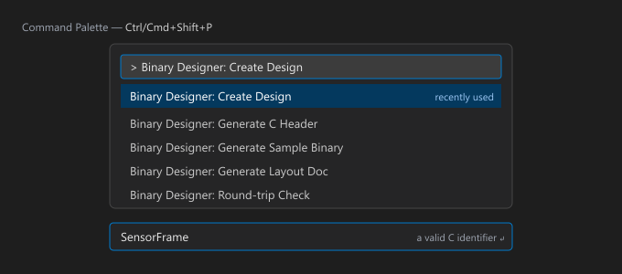
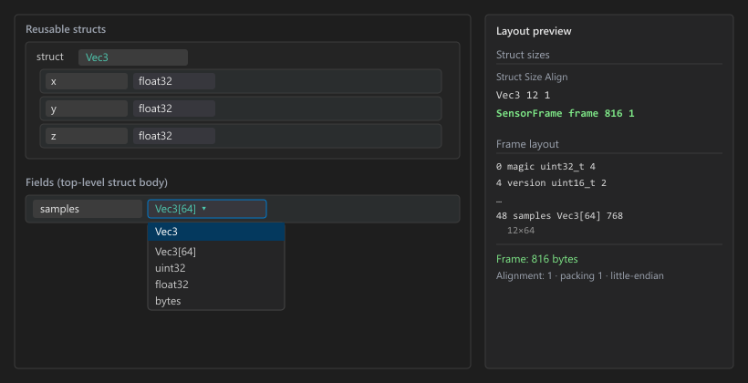
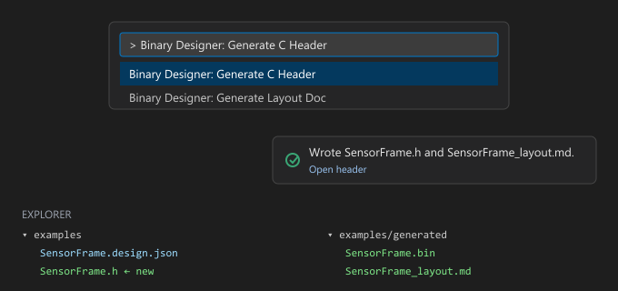

# Binary File Designer

Design binary structures in VS Code: a form / tree editor for a `*.design.json`
file that **produces artifacts** from the design — a sample `.bin`, a C header,
and a layout document — for firmware, EEPROM / flash images, device-config
blobs, wire protocols and other fixed-layout binary formats.

It is the design-time counterpart to a binary *viewer*: instead of decoding an
existing file against a format, you lay out the structure and the extension
generates from it. Built on the VS Code **Custom Editor API**; the layout
engine, validator and generators are a pure, unit-tested core with no `vscode`
dependency, and nothing in a design is ever executed.

## Tabs

The editor has three tabs — **Form**, **JSON**, **Binary** — and they are three
*views of the exact same document*, not three copies of it. There is one
`*.design.json`; whichever tab you edit, the other two update immediately:

- Change a type or drag a field in the **Form** tab → the **JSON** tab's text
  updates and the **Binary** tab re-emits the hex dump.
- Edit raw JSON in the **JSON** tab → the **Form** tree rebuilds to match and
  the **Binary** tab re-emits.
- Add or reorder a field by dragging in the **Binary** tab → both the **Form**
  tree and the **JSON** text update.

Nothing needs a manual refresh or a re-open, and switching tabs never loses
unsaved changes — **Save** / **Save draft** write the one underlying document,
whichever tab you're looking at. Pick which tab a design opens on with
[`binaryDesigner.defaultView`](#settings).

### Form tab

The tree editor. This is where you build the design without hand-writing JSON:

- **Add a field**: **+ Field** / **+ Array** / **+ Enum** / **+ Struct**, at the
  top level or inside any struct.
- **Set its type** from the **dropdown** — every scalar/composite plus each
  reusable struct you've defined, so nothing needs typing. The **size** field
  next to it is only enabled for types that actually need one (`bytes`,
  `padding`, `ascii`, `utf8`, `utf16`) — grayed out otherwise, since a fixed
  type like `uint32` or a struct name has no "size" to set.
- **Make it an array**: click **`[]`** for a fixed size (`count`) or a
  length-prefixed one (`countField`) — no `Name[64]` shorthand to remember.
- **`{}`** adds an inline `enum` (value → label) table; **`b`** adds a bitfield
  (name : width) table; **`rsv`** marks the field reserved for future use.
- **Reorder** by dragging a row's **`⠿`** grip; **`⧉`** duplicates a row (and
  its subtree); **`✕`** deletes it.
- **Reusable structs**: define a layout once under **+ struct**, then pick it
  by name from any field's type dropdown, anywhere in the design.
- **Undo / Redo** (toolbar, or Ctrl/Cmd+Z) step back and forward through every
  edit — form, JSON, or Binary-tab — the same way any text edit does, because
  every change is a real edit on the underlying `*.design.json`.
- **Packing**: set it to **`none`** to compare the *natural* (compiler-default)
  byte layout against a packed one —
  see [Packing: on, off, or none](#packing-on-off-or-none).
- Watch the **layout preview** (right-hand panel) as you go — struct sizes,
  offsets, and any padding the packer inserts update on every change.


### JSON tab

The whole design as text — full control, including shapes the tree can't show
(multi-dimensional arrays like `int16[4][3]`). It's auto-selected the moment a
design needs that; otherwise switch to it any time for bulk edits, copy-paste,
or diffing. Parse errors and validation issues appear in the status bar above
both tabs; fix them and the Form and Binary tabs pick the change up as soon as
the JSON parses.

### Binary tab

The sample binary this design would emit, as a classic `Offset · Hex · ASCII`
dump with each top-level field's bytes colour-coded:

- **Hover** a byte, a field chip, or a layout-preview row — the other two
  cross-highlight so you can see exactly which bytes are which field.
- **Add a field without leaving this tab**: click a type in the **Add** palette
  (`u8 … f64`, `char[16]`, `bytes[4]`, `enum`, `array`, `struct`, `reserve u32`,
  `reserve[16]`, and every reusable struct) to append it, or **drag** the type
  onto a byte to insert it exactly there.
- **Reorder**: drag a field's chip or its highlighted bytes onto another field;
  drop on the dashed end zone to move it last.
- Reserved slots (`reserve u32` / `reserve[16]`, or the `rsv` toggle in the Form
  tab) render hatched, so future-use space is obviously not "real" data.

Everything here edits the design the same way the Form tab does — it's the same
document, just a different way of seeing and rearranging it.


## Generators

Three commands, each with a *do not edit / regenerate from `<source>`* banner:

- **Generate Sample Binary** walks the design and writes `<name>.bin` from each
  field's `value` (or a sensible default), honouring `packing` and per-field
  endianness. It reports the byte count and any defaulted fields and offers a
  round-trip check.
- **Generate C Header** emits `<name>.h` with `#pragma pack`, typedef'd
  structs / enums / bitfields in dependency order, and a `_Static_assert` on
  `sizeof` so layout drift fails the compile.
- **Generate Layout Doc** writes `<name>_layout.md` — the offset table on its
  own.

```c
/* Generated by Binary File Designer — do not edit. Regenerate from SensorFrame.design.json. */
#ifndef SENSOR_FRAME_H
#define SENSOR_FRAME_H

#include <stdint.h>

#pragma pack(push, 1)          /* from design.packing */

typedef struct Vec3 {
    float x;  /* acceleration X (m/s^2) */
    float y;  /* acceleration Y (m/s^2) */
    float z;  /* acceleration Z (m/s^2) */
} Vec3;

typedef enum SensorFrame_state {
    SENSOR_FRAME_STATE_IDLE   = 0,
    SENSOR_FRAME_STATE_ACTIVE = 1,
    SENSOR_FRAME_STATE_FAULT  = 2
} SensorFrame_state;

typedef struct SensorFrame_flags {
    uint8_t enabled  : 1;  /* acquisition running */
    uint8_t mode     : 3;  /* 0=raw 1=filtered 2=fused */
    uint8_t reserved : 4;  /* must be zero */
} SensorFrame_flags;

typedef struct SensorFrame {
    uint32_t          magic;          /* file magic 'FRM1' */
    uint16_t          version;        /* format version */
    uint8_t           state;          /* current acquisition state */
    SensorFrame_flags flags;          /* packed status bits */
    uint16_t          reserved0;      /* reserved header word — do not use */
    uint16_t          sample_count;   /* logical number of valid samples in the bank */
    int16_t           temps[4];       /* board temperatures, 0.1 C units, one per quadrant */
    char              label[16];      /* human-readable frame label */
    uint8_t           reserved1[12];  /* reserved for future header fields */
    Vec3              samples[64];    /* fixed sample bank; cycles the three basis vectors */
} SensorFrame;

#pragma pack(pop)

_Static_assert(sizeof(SensorFrame) == 816, "SensorFrame layout drift");

#endif /* SENSOR_FRAME_H */
```

## What you get

- **Form / JSON / Binary tabs** — three views of one document, always in sync:
  a tree editor, a raw-JSON tab (auto-selected when the tree can't represent
  the design losslessly), and a live hex dump of the sample binary. Edit any
  one and the other two update immediately — see [Tabs](#tabs).
- **Tree editor** — fields, arrays, enums, bitfields and reusable structs; a
  **type dropdown** listing every scalar/composite and reusable struct (no
  typing), a `[]` toggle for a fixed-size array instead of `Name[64]` shorthand;
  inline `enum` (value → label) and bitfield (name : width) tables; drag a row's
  `⠿` grip to reorder; duplicate, move in / out of structs.
- **Struct sizes** — a table of every reusable and inline struct with its own
  size and alignment, then the frame total, so nested layouts are sized at a
  glance rather than only the whole frame.
- **Layout preview** — `Offset · Name · C type · Size` (with `elem × count` for
  arrays) under the design's `packing` and `endianness`, plus the total size and
  every packer-inserted padding byte.
- **Binary tab** — the sample binary as an `Offset · Hex · ASCII` dump, each
  field's bytes colour-coded; hover a byte, a field chip or a layout row to
  cross-highlight the other two.
- **Add fields from the hex view** — an Add palette (`u8 … f64`, `char[16]`,
  `bytes[4]`, `enum`, `array`, `struct`, `reserve u32`, `reserve[16]`, every
  reusable struct); click to append or drag onto a byte to insert there.
- **Drag to rearrange** — drag a field's chip or its highlighted bytes onto
  another field to reorder the top-level struct; the `.design.json`, the hex and
  the generated header all follow.
- **Reserved slots** — mark a field `"reserved": true` (the palette entries or
  the `rsv` toggle) to hold space for the future: it keeps its size and offset,
  is zero-filled, is left out of the "defaulted" report, renders hatched, and is
  labelled *reserved* in the header and layout doc.
- **Types** — `uint8 … int64`, `float32` / `float64`, `char[N]`, `bytes` /
  `padding`, `ascii` / `utf8` / `utf16`, inline `struct`, reusable struct names,
  `array`; shorthand `<base>[<n>]` and multi-dimensional `int16[4][3]`.
- **Reusable structs** — define a layout once under `structs`, then use its name
  as a field or array-element type (`"Vec3"`, `"Vec3[64]"`); emitted in
  dependency order in the header.
- **Length-prefixed arrays** — `"countField": "n"` sizes an array from an
  earlier integer field's value instead of a fixed `count`.
- **Constants** — a named-constant map usable as a field `value`
  (`"value": "MAGIC"`), hex strings included.
- **Sample values** — a JSON literal, a constant name, or a tiny
  non-Turing-complete expression: `["const", v]`, `["ramp", start, step?]`,
  `["repeat", …]`, `["random", seed]`; struct arrays take struct literals.
- **Identifier validation** — every name that becomes a C identifier is checked
  live and again, hard, before generation: `^[A-Za-z_]\w*$`, no C / C++ keyword
  or `stdint` typedef, no leading `_Upper` or `__`; a one-click *fix name*
  snake-cases and de-dupes. `validateIdentifier(name, kind)` is a pure,
  unit-tested module.
- **Round-trip check** — re-parse the generated bytes against the design and
  assert every field reads back exactly what was written.
- **Undo / Redo** — toolbar buttons (and Ctrl/Cmd+Z, where focus allows) walk
  back and forward through every edit, from any of the three tabs, since each
  one is a real edit on the document.
- **Packing on, off, or none** — `"packing": false` disables packing entirely
  (natural, compiler-default alignment — no `#pragma pack`), so you can compare
  a design's byte layout with and without packing, or keep it fully packed
  (`1`) and place `"reserved"` fields yourself wherever you want explicit
  padding. See [Packing: on, off, or none](#packing-on-off-or-none).
- **Generate on save** (opt-in, `binaryDesigner.generateOnSave`) — re-run
  chosen generators automatically every time you save a design.
- **Pick your starting tab** (`binaryDesigner.defaultView`) and the Binary
  tab's **bytes per row** / **max bytes shown** (`binaryDesigner.binaryTab.*`,
  the latter applies live, no reopen needed) — see [Settings](#settings).
- **Designs view** — an Activity Bar list of every `*.design.json` in the
  workspace (size / error count), kept live by a file watcher. Empty (no
  designs, or no folder open at all) shows **Create Design** and **Open
  Folder** right there instead of a blank panel.
- **Pure, tested core** — `src/core/` (layout engine, `validateDesign`,
  `validateIdentifier`, the emitters, the parser) has no `vscode` dependency and
  is covered by 58 Mocha tests, including golden C headers verified to compile
  under `-Wall -Werror -Wextra -pedantic`.
- Native VS Code look — theme variables throughout, so light, dark and
  high-contrast all work.

Design-time only — nothing in a `.design.json` is ever executed; the
sample-value expression vocabulary is a fixed enum evaluated by hand-written
code, and the header generator only emits, it never imports `.h`.

## Getting started

1. Run **Binary Designer: Create Design** (Command Palette) to scaffold a new
   `*.design.json`, or open an existing one — it opens in the form editor, not a
   text editor.
2. Lay out the top-level struct in the **Form** tab; watch the **layout
   preview** for offsets, size and padding.
3. Switch to the **Binary** tab to see the bytes, add fields from the **Add**
   palette, and drag fields to reorder — or drop into the **JSON** tab for bulk
   edits. All three tabs always show the same design; see [Tabs](#tabs).
4. Run **Binary Designer: Generate C Header** (and **Generate Sample Binary** /
   **Generate Layout Doc**) from the palette, the editor toolbar, the Designs
   view, or the Explorer right-click menu — or turn on
   `binaryDesigner.generateOnSave` to run them automatically every time you save.

### The design schema

A design is a plain JSON object saved as `Something.design.json`. There is no
expression language and nothing in it is executed.

```jsonc
{
  "name": "SensorFrame",       // required; a valid C identifier — the top-level struct
  "endianness": "little",      // "little" | "big"; default "little"
  "packing": 1,                // 1 | 2 | 4 | 8, or false to disable packing; default 1
  "description": "…",
  "constants": {               // named constants usable as a field "value"
    "SENSOR_MAGIC": "0x46524d31",
    "SENSOR_VERSION": 2
  },
  "structs": {                 // reusable nested structs, keyed by C identifier
    "Vec3": { "fields": [
      { "name": "x", "type": "float32" },
      { "name": "y", "type": "float32" },
      { "name": "z", "type": "float32" }
    ] }
  },
  "fields": [
    { "name": "magic",   "type": "uint32", "value": "SENSOR_MAGIC" },
    { "name": "version", "type": "uint16", "value": "SENSOR_VERSION" },
    {
      "name": "state", "type": "uint8", "value": 1,
      "enum": { "0": "idle", "1": "active", "2": "fault" }
    },
    {
      "name": "flags", "type": "uint8",
      "value": { "enabled": 1, "mode": 2 },
      "bits": [
        { "name": "enabled",  "width": 1 },
        { "name": "mode",     "width": 3, "enum": { "0": "raw", "1": "filtered" } },
        { "name": "reserved", "width": 4 }
      ]
    },
    { "name": "reserved0", "type": "uint16", "reserved": true },
    { "name": "sample_count", "type": "uint16", "value": 64 },
    { "name": "temps", "type": "int16[4]", "value": ["ramp", -20, 10] },
    { "name": "label", "type": "char[16]", "value": "sensor-01" },
    {
      "name": "samples", "type": "Vec3[64]",
      "value": ["repeat", { "x": 1, "y": 0, "z": 0 }, { "x": 0, "y": 1, "z": 0 }]
    }
  ]
}
```

A field's `array: { "count": 8 }` (fixed) or `array: { "countField": "n" }`
(length-prefixed) wraps any type; `size` is required for `bytes` / `padding` /
`ascii` / `utf8` / `utf16` — the Form tab disables that field for every other
type instead of leaving it to be ignored; `offset` pins an explicit offset;
`endianness` overrides per field; `reserved: true` marks a future-use slot.

### Packing: on, off, or none

`"packing"` takes `1`, `2`, `4`, `8` — or **`false`** to disable packing
entirely. With packing disabled, every member uses its *natural* alignment,
uncapped — exactly what a plain C struct with no `#pragma pack` would do on a
real compiler (verified against `gcc`), padding included. With a packing
number, alignment is capped at that value; **`1`** is the tightest — nothing is
ever rounded up, so the packer inserts *zero* implicit padding.

This gives you two ways to control alignment, and it's worth knowing which one
you're using:

- **See what "no packing" looks like** — set `"packing": false` and compare the
  Binary tab / layout preview against `"packing": 1` for the same fields. This
  is how you check what a design would look like as an ordinary (unpacked) C
  struct before deciding to force packing.
- **Make every byte explicit** — keep `"packing": 1` (fully packed, no
  implicit padding ever) and add your own `"reserved"` fields anywhere you want
  alignment or a gap. Nothing is inserted that you didn't put there yourself.

The C header follows the same switch: `false` emits no `#pragma pack` at all
(and says so in a comment); a number emits the matching
`#pragma pack(push, N)` / `#pragma pack(pop)`. The `_Static_assert` always
checks the real computed size either way.

## Creating a frame — walkthrough

Build the `SensorFrame` example from scratch.

### 1 — New design

Run **Binary Designer: Create Design** from the Command Palette and give it a
name that is a valid C identifier (it becomes the top-level `struct` tag). The
file opens in the form editor, not a text editor.



### 2 — Lay out the header

In the **Form** tab, use **+ Field** to add the fixed header — `magic`
(`uint32`), `version` (`uint16`), `state` (`uint8`), `flags` (`uint8`) — pick
each row's type from the dropdown and set its design-time `value`. Toggle
**`{}`** on a row for an inline `enum` table and **`b`** for a bitfield
(name : width) table. The layout preview on the right updates every keystroke.


### 3 — Add a reusable struct, then use it

In **Reusable structs**, click **+ struct**, name it `Vec3`, and add `x` / `y` /
`z` as `float32`. Back in **Fields**, add a `samples` field, pick **`Vec3`**
from the type dropdown — every struct you define shows up there automatically
— and click **`[]`** to make it a fixed-size array, then set `count` to `64`.
No typing required, and no `Vec3[64]` shorthand to remember. The **Struct
sizes** panel now lists `Vec3` at 12 bytes alongside the growing frame total.



### 4 — See the bytes and rearrange

Switch to the **Binary** tab. Each field's bytes are colour-coded; drag a field
chip (or its highlighted bytes) onto another to reorder the struct, drag a type
from the **Add** palette onto a byte to insert it there, and use **reserve u32**
/ **reserve[16]** for space held for the future. Everything writes straight back
to the `.design.json`.


### 5 — Generate

Run **Binary Designer: Generate C Header** (and **Generate Sample Binary** /
**Generate Layout Doc**) from the palette, the editor toolbar, the Designs view,
or the Explorer right-click menu. You get `<name>.h` + `<name>_layout.md` (and
`<name>.bin`) next to the design, or in `binaryDesigner.outputFolder`.



## Commands

| Command | What it does |
| --- | --- |
| Binary Designer: Create Design | scaffold a new `*.design.json` and open it in the form editor |
| Binary Designer: Generate Sample Binary | walk the design → `<name>.bin`; report bytes + defaulted fields; offer a round-trip check |
| Binary Designer: Generate C Header | `<name>.h` (+ `<name>_layout.md`) — `#pragma pack`, typedef'd structs / enums / bitfields, `_Static_assert` on `sizeof` |
| Binary Designer: Generate Layout Doc | just `<name>_layout.md` — the offset table |
| Binary Designer: Round-trip Check | emit → re-parse → assert every field reads back what was written |
| Binary Designer: Open Design | open a `*.design.json` in the form editor |

Generators also appear on the editor toolbar, the Designs-view context menu, and
the Explorer right-click menu for a `*.design.json`.

## Settings

Open **Settings** (<kbd>Ctrl/Cmd+,</kbd>) and search **"Binary Designer"** to
get a form for all of these, or set them directly in `.vscode/settings.json` —
either works, and either can be set per-workspace or for every workspace (User
settings). None of them require a reload; a design already open picks most of
them up the next time you open it, and the Binary-tab display settings apply
live to editors that are already open.

[`examples/.vscode/settings.json`](examples/.vscode/settings.json) is a
ready-to-copy example covering every setting below, with comments explaining
each choice — it's also what's active when you press <kbd>F5</kbd> from this
repo, since that opens `examples/` as the workspace.

### Output

| Setting | Default | Description |
| --- | --- | --- |
| `binaryDesigner.outputFolder` | `""` | Folder for generated artifacts, relative to the workspace root. Empty = next to the design file. |
| `binaryDesigner.generateOnSave` | `[]` | Run these generators automatically on every save: any of `binary`, `header`, `layoutDoc`. Empty = off. Behaves exactly like running the command by hand. |

### Layout

| Setting | Default | Description |
| --- | --- | --- |
| `binaryDesigner.defaultPacking` | `1` | Struct packing (bytes) used when a design omits `packing`. |

### C header

| Setting | Default | Description |
| --- | --- | --- |
| `binaryDesigner.header.staticAssert` | `true` | Emit `_Static_assert(sizeof(...) == N)` so layout drift fails the compile. |
| `binaryDesigner.header.includeStyle` | `angle` | `#include <stdint.h>` vs `"stdint.h"`. |
| `binaryDesigner.header.enumTypedefForFields` | `false` | Declare enum fields with the generated enum typedef instead of their integer type. |
| `binaryDesigner.header.arrayMax` | `0` | Fixed `[MAX]` capacity for `array.countField` members in the header (`0` = prompt when generating). |

### Editor

| Setting | Default | Description |
| --- | --- | --- |
| `binaryDesigner.defaultView` | `form` | Which tab a design opens on: `form`, `json`, or `binary`. All three always show the same document. |
| `binaryDesigner.binaryTab.bytesPerRow` | `16` | Bytes per row in the Binary tab's hex dump: `8`, `16`, or `32`. |
| `binaryDesigner.binaryTab.maxBytesShown` | `8192` | Cap on bytes rendered inline; a bigger sample binary shows its size and a prompt to use **Generate Sample Binary** instead. Raise it for a large frame if your machine can take the extra rendering. |
| `binaryDesigner.identifierAutoFix` | `true` | Offer one-click *fix name* actions for invalid C identifiers in the editor. |

## Building from source

```bash
npm install
npm run compile       # esbuild bundle -> dist/extension.js, then tsc type-check
npm run watch         # incremental esbuild
npm run check-types   # tsc -p tsconfig.json && tsc -p tsconfig.webview.json
npm run lint          # eslint src
npm test              # 58 Mocha unit tests: layout, validator, emitter <-> parser, header golden
npm run example       # regenerate examples/generated/* from examples/SensorFrame.design.json
npm run package       # -> binary-file-designer-<version>.vsix (via @vscode/vsce)
```

Press <kbd>F5</kbd> for an Extension Development Host with `examples/` open. The
extension bundles to a single `dist/extension.js`; `src/core/` is pure and
type-checked separately from the CSP-locked webview scripts in `media/`.

## Versions

| Version | Highlights |
| --- | --- |
| **0.4.0** | Size field disables itself for fixed-size types; `"packing": false` (natural alignment, no `#pragma pack`); Undo / Redo toolbar; Designs-view empty state (Create Design / Open Folder) |
| **0.3.0** | Type dropdown + `[]` array toggle (no typing); fixed JSON-edits-not-reaching-Form-tab; `defaultView` / `generateOnSave` / `binaryTab.*` settings; README "Tabs" + regrouped Settings docs |
| **0.2.0** | Binary tab (colour-coded hex dump, Add palette, drag-to-reorder); reserved fields; per-struct sizes in the preview / layout doc; frame-creation walkthrough |
| **0.1.0** | Form / JSON editor, three generators, round-trip check, pure tested `src/core/` |

See [CHANGELOG.md](CHANGELOG.md) for details.

## Author

Devontae Reid — [www.devontaereid.com](https://www.devontaereid.com) ·
[github.com/y0dev/binary_designer_extension](https://github.com/y0dev/binary_designer_extension)

## License

MIT — see [LICENSE](LICENSE).
