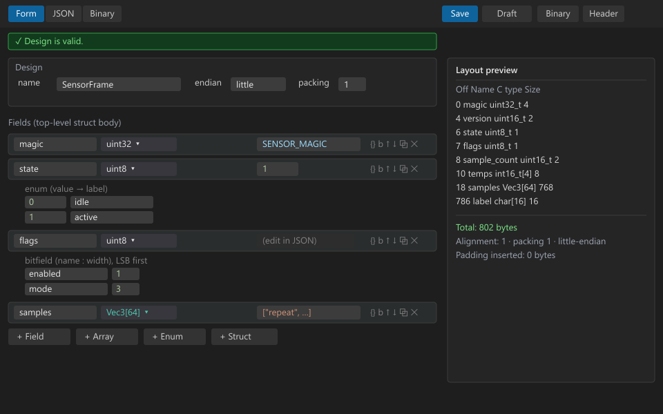

# Binary File Designer

Design binary structures in VS Code: a form / tree editor for a `*.design.json`
file that **produces artifacts** from the design — a sample `.bin`, a C header,
and a layout document — for firmware, EEPROM / flash images, device-config
blobs, wire protocols and other fixed-layout binary formats.

It is the design-time counterpart to a binary *viewer*: instead of decoding an
existing file against a format, you lay out the structure and the extension
generates from it. Built on the VS Code **Custom Editor API**; the layout
engine, validator and generators are a pure, unit-tested core with no `vscode`
dependency, and nothing in a design is ever executed.

## Form editor

A tree editor for the design: add fields, arrays, enums, bitfields and reusable
structs; a type combo (scalars + composites + struct names + free-typed
shorthand); inline `enum` (value → label) and bitfield (name : width) tables;
drag a row's grip to reorder, duplicate a row, move in / out of structs. A
**JSON tab** edits the whole design as text and is auto-selected when the tree
can't represent it losslessly (multi-dimensional arrays). A live **layout
preview** shows `Offset · Name · C type · Size` computed under the design's
`packing` and `endianness`, with the total size and every padding byte the
packer inserts.



## Binary tab

The sample binary this design would emit, rendered as a classic
`Offset · Hex · ASCII` dump with each top-level field's bytes colour-coded.
Hover a byte, a field chip or a layout-preview row and the other two
cross-highlight. An **Add** palette (`u8 … f64`, `char[16]`, `bytes[4]`, `enum`,
`array`, `struct`, `reserve u32`, `reserve[16]`, and every reusable struct)
appends a field on click or, dragged onto a byte, inserts it there. Drag an
existing field — its chip or its highlighted bytes — onto another to reorder the
top-level struct; drop on the end zone to move it last. Every edit is written
straight back to the `.design.json`, the hex re-emits, and the generated header
and layout doc follow.


## Generators

Three commands, each with a *do not edit / regenerate from `<source>`* banner:

- **Generate Sample Binary** walks the design and writes `<name>.bin` from each
  field's `value` (or a sensible default), honouring `packing` and per-field
  endianness. It reports the byte count and any defaulted fields and offers a
  round-trip check.
- **Generate C Header** emits `<name>.h` with `#pragma pack`, typedef'd
  structs / enums / bitfields in dependency order, and a `_Static_assert` on
  `sizeof` so layout drift fails the compile.
- **Generate Layout Doc** writes `<name>_layout.md` — the offset table on its
  own.

```c
/* Generated by Binary File Designer — do not edit. Regenerate from SensorFrame.design.json. */
#ifndef SENSOR_FRAME_H
#define SENSOR_FRAME_H

#include <stdint.h>

#pragma pack(push, 1)          /* from design.packing */

typedef struct Vec3 {
    float x;  /* acceleration X (m/s^2) */
    float y;  /* acceleration Y (m/s^2) */
    float z;  /* acceleration Z (m/s^2) */
} Vec3;

typedef enum SensorFrame_state {
    SENSOR_FRAME_STATE_IDLE   = 0,
    SENSOR_FRAME_STATE_ACTIVE = 1,
    SENSOR_FRAME_STATE_FAULT  = 2
} SensorFrame_state;

typedef struct SensorFrame_flags {
    uint8_t enabled  : 1;  /* acquisition running */
    uint8_t mode     : 3;  /* 0=raw 1=filtered 2=fused */
    uint8_t reserved : 4;  /* must be zero */
} SensorFrame_flags;

typedef struct SensorFrame {
    uint32_t          magic;          /* file magic 'FRM1' */
    uint16_t          version;        /* format version */
    uint8_t           state;          /* current acquisition state */
    SensorFrame_flags flags;          /* packed status bits */
    uint16_t          reserved0;      /* reserved header word — do not use */
    uint16_t          sample_count;   /* logical number of valid samples in the bank */
    int16_t           temps[4];       /* board temperatures, 0.1 C units, one per quadrant */
    char              label[16];      /* human-readable frame label */
    uint8_t           reserved1[12];  /* reserved for future header fields */
    Vec3              samples[64];    /* fixed sample bank; cycles the three basis vectors */
} SensorFrame;

#pragma pack(pop)

_Static_assert(sizeof(SensorFrame) == 816, "SensorFrame layout drift");

#endif /* SENSOR_FRAME_H */
```

## What you get

- **Form / JSON / Binary tabs** — a tree editor for the design, a raw-JSON tab
  (auto-selected when the tree can't represent the design losslessly), and a
  live hex dump of the sample binary; edits round-trip between all three.
- **Tree editor** — fields, arrays, enums, bitfields and reusable structs; a
  type combo; inline `enum` (value → label) and bitfield (name : width) tables;
  drag a row's `⠿` grip to reorder; duplicate, move in / out of structs.
- **Layout preview** — `Offset · Name · C type · Size` under the design's
  `packing` and `endianness`, with the total size and every packer-inserted
  padding byte.
- **Binary tab** — the sample binary as an `Offset · Hex · ASCII` dump, each
  field's bytes colour-coded; hover a byte, a field chip or a layout row to
  cross-highlight the other two.
- **Add fields from the hex view** — an Add palette (`u8 … f64`, `char[16]`,
  `bytes[4]`, `enum`, `array`, `struct`, `reserve u32`, `reserve[16]`, every
  reusable struct); click to append or drag onto a byte to insert there.
- **Drag to rearrange** — drag a field's chip or its highlighted bytes onto
  another field to reorder the top-level struct; the `.design.json`, the hex and
  the generated header all follow.
- **Reserved slots** — mark a field `"reserved": true` (the palette entries or
  the `rsv` toggle) to hold space for the future: it keeps its size and offset,
  is zero-filled, is left out of the "defaulted" report, renders hatched, and is
  labelled *reserved* in the header and layout doc.
- **Types** — `uint8 … int64`, `float32` / `float64`, `char[N]`, `bytes` /
  `padding`, `ascii` / `utf8` / `utf16`, inline `struct`, reusable struct names,
  `array`; shorthand `<base>[<n>]` and multi-dimensional `int16[4][3]`.
- **Reusable structs** — define a layout once under `structs`, then use its name
  as a field or array-element type (`"Vec3"`, `"Vec3[64]"`); emitted in
  dependency order in the header.
- **Length-prefixed arrays** — `"countField": "n"` sizes an array from an
  earlier integer field's value instead of a fixed `count`.
- **Constants** — a named-constant map usable as a field `value`
  (`"value": "MAGIC"`), hex strings included.
- **Sample values** — a JSON literal, a constant name, or a tiny
  non-Turing-complete expression: `["const", v]`, `["ramp", start, step?]`,
  `["repeat", …]`, `["random", seed]`; struct arrays take struct literals.
- **Identifier validation** — every name that becomes a C identifier is checked
  live and again, hard, before generation: `^[A-Za-z_]\w*$`, no C / C++ keyword
  or `stdint` typedef, no leading `_Upper` or `__`; a one-click *fix name*
  snake-cases and de-dupes. `validateIdentifier(name, kind)` is a pure,
  unit-tested module.
- **Round-trip check** — re-parse the generated bytes against the design and
  assert every field reads back exactly what was written.
- **Designs view** — an Activity Bar list of every `*.design.json` in the
  workspace (size / error count), kept live by a file watcher.
- **Pure, tested core** — `src/core/` (layout engine, `validateDesign`,
  `validateIdentifier`, the emitters, the parser) has no `vscode` dependency and
  is covered by 50 Mocha tests, including golden C headers verified to compile
  under `-Wall -Werror -Wextra -pedantic`.
- Native VS Code look — theme variables throughout, so light, dark and
  high-contrast all work.

Design-time only — nothing in a `.design.json` is ever executed; the
sample-value expression vocabulary is a fixed enum evaluated by hand-written
code, and the header generator only emits, it never imports `.h`.

## Getting started

1. Run **Binary Designer: Create Design** (Command Palette) to scaffold a new
   `*.design.json`, or open an existing one — it opens in the form editor, not a
   text editor.
2. Lay out the top-level struct in the **Form** tab; watch the **layout
   preview** for offsets, size and padding.
3. Switch to the **Binary** tab to see the bytes, add fields from the **Add**
   palette, and drag fields to reorder.
4. Run **Binary Designer: Generate C Header** (and **Generate Sample Binary** /
   **Generate Layout Doc**) from the palette, the editor toolbar, the Designs
   view, or the Explorer right-click menu.

### The design schema

A design is a plain JSON object saved as `Something.design.json`. There is no
expression language and nothing in it is executed.

```jsonc
{
  "name": "SensorFrame",       // required; a valid C identifier — the top-level struct
  "endianness": "little",      // "little" | "big"; default "little"
  "packing": 1,                // 1 | 2 | 4 | 8; default 1
  "description": "…",
  "constants": {               // named constants usable as a field "value"
    "SENSOR_MAGIC": "0x46524d31",
    "SENSOR_VERSION": 2
  },
  "structs": {                 // reusable nested structs, keyed by C identifier
    "Vec3": { "fields": [
      { "name": "x", "type": "float32" },
      { "name": "y", "type": "float32" },
      { "name": "z", "type": "float32" }
    ] }
  },
  "fields": [
    { "name": "magic",   "type": "uint32", "value": "SENSOR_MAGIC" },
    { "name": "version", "type": "uint16", "value": "SENSOR_VERSION" },
    {
      "name": "state", "type": "uint8", "value": 1,
      "enum": { "0": "idle", "1": "active", "2": "fault" }
    },
    {
      "name": "flags", "type": "uint8",
      "value": { "enabled": 1, "mode": 2 },
      "bits": [
        { "name": "enabled",  "width": 1 },
        { "name": "mode",     "width": 3, "enum": { "0": "raw", "1": "filtered" } },
        { "name": "reserved", "width": 4 }
      ]
    },
    { "name": "reserved0", "type": "uint16", "reserved": true },
    { "name": "sample_count", "type": "uint16", "value": 64 },
    { "name": "temps", "type": "int16[4]", "value": ["ramp", -20, 10] },
    { "name": "label", "type": "char[16]", "value": "sensor-01" },
    {
      "name": "samples", "type": "Vec3[64]",
      "value": ["repeat", { "x": 1, "y": 0, "z": 0 }, { "x": 0, "y": 1, "z": 0 }]
    }
  ]
}
```

A field's `array: { "count": 8 }` (fixed) or `array: { "countField": "n" }`
(length-prefixed) wraps any type; `size` is required for `bytes` / `padding` /
`ascii` / `utf8` / `utf16`; `offset` pins an explicit offset; `endianness`
overrides per field; `reserved: true` marks a future-use slot.

## Commands

| Command | What it does |
| --- | --- |
| Binary Designer: Create Design | scaffold a new `*.design.json` and open it in the form editor |
| Binary Designer: Generate Sample Binary | walk the design → `<name>.bin`; report bytes + defaulted fields; offer a round-trip check |
| Binary Designer: Generate C Header | `<name>.h` (+ `<name>_layout.md`) — `#pragma pack`, typedef'd structs / enums / bitfields, `_Static_assert` on `sizeof` |
| Binary Designer: Generate Layout Doc | just `<name>_layout.md` — the offset table |
| Binary Designer: Round-trip Check | emit → re-parse → assert every field reads back what was written |
| Binary Designer: Open Design | open a `*.design.json` in the form editor |

Generators also appear on the editor toolbar, the Designs-view context menu, and
the Explorer right-click menu for a `*.design.json`.

## Settings

| Setting | Default | Description |
| --- | --- | --- |
| `binaryDesigner.outputFolder` | `""` | Folder for generated artifacts, relative to the workspace root; empty = next to the design file |
| `binaryDesigner.defaultPacking` | `1` | Struct packing (bytes) used when a design omits `packing` |
| `binaryDesigner.header.staticAssert` | `true` | Emit `_Static_assert(sizeof(...) == N)` so layout drift fails the compile |
| `binaryDesigner.header.includeStyle` | `angle` | `#include <stdint.h>` vs `"stdint.h"` |
| `binaryDesigner.header.enumTypedefForFields` | `false` | Declare enum fields with the generated enum typedef instead of their integer type |
| `binaryDesigner.header.arrayMax` | `0` | Fixed `[MAX]` capacity for `array.countField` members in the header (`0` = prompt) |
| `binaryDesigner.identifierAutoFix` | `true` | Offer one-click *fix name* actions for invalid C identifiers in the editor |

## Building from source

```bash
npm install
npm run compile       # esbuild bundle -> dist/extension.js, then tsc type-check
npm run watch         # incremental esbuild
npm run check-types   # tsc -p tsconfig.json && tsc -p tsconfig.webview.json
npm run lint          # eslint src
npm test              # 50 Mocha unit tests: layout, validator, emitter <-> parser, header golden
npm run example       # regenerate examples/generated/* from examples/SensorFrame.design.json
npm run package       # -> binary-file-designer-<version>.vsix (via @vscode/vsce)
```

Press <kbd>F5</kbd> for an Extension Development Host with `examples/` open. The
extension bundles to a single `dist/extension.js`; `src/core/` is pure and
type-checked separately from the CSP-locked webview scripts in `media/`.

## Author

Devontae Reid — [www.devontaereid.com](https://www.devontaereid.com) ·
[github.com/y0dev/binary_designer_extension](https://github.com/y0dev/binary_designer_extension)

## License

MIT — see [LICENSE](LICENSE).
